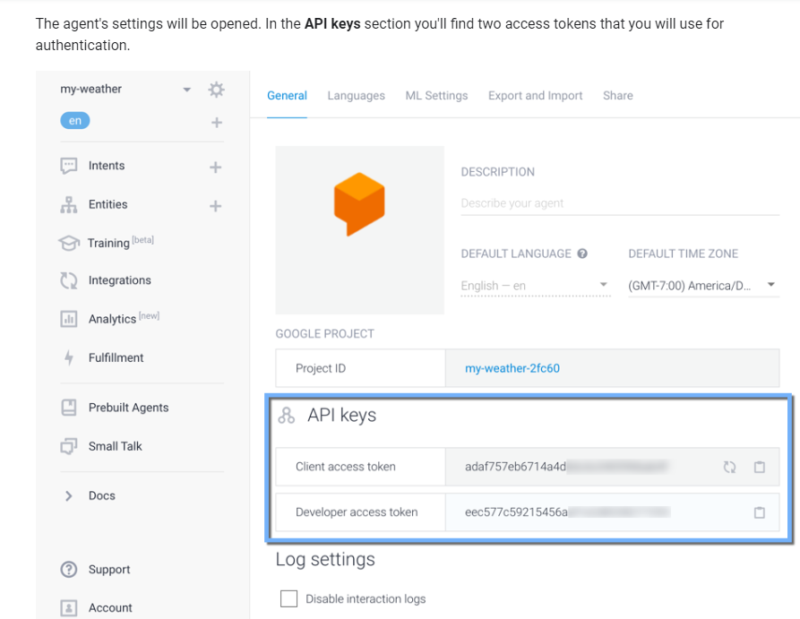
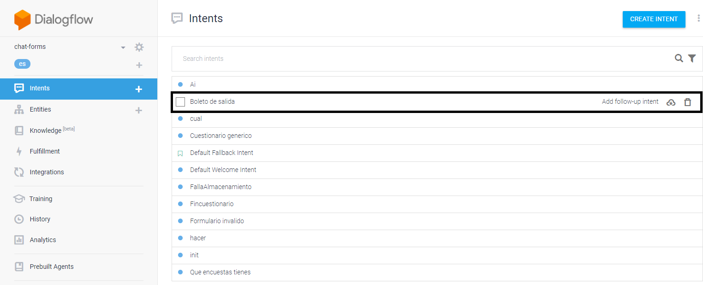
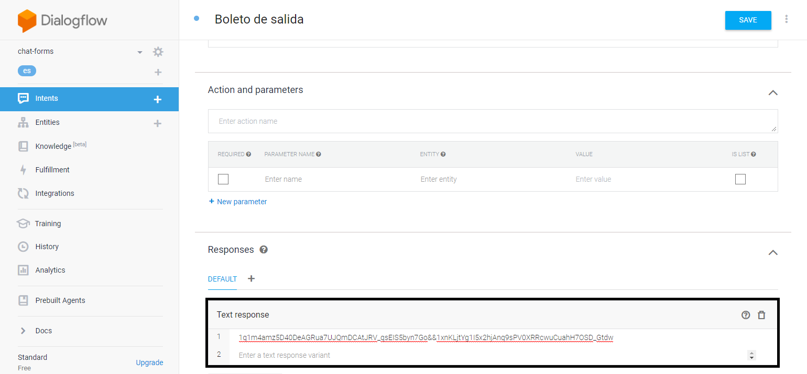

# Dialogflow-AngularJS-GForms-GSheets
Chatbot con integración de Google Forms y Google Spreadsheets con base de Dialogflow

## Dialogflow User Agent
[Dialogflow Agent](https://dialogflow.com/docs/reference/agent)

  ### Console Dialogflow
  [Console](https://console.dialogflow.com)

## Client access token

```bash
js/dialogflow.js

var accessToken = <Your_Access_Token>;
```

## Configure forms response (Dialogflow console)
  - Intent name request


  - ID response Google Forms

